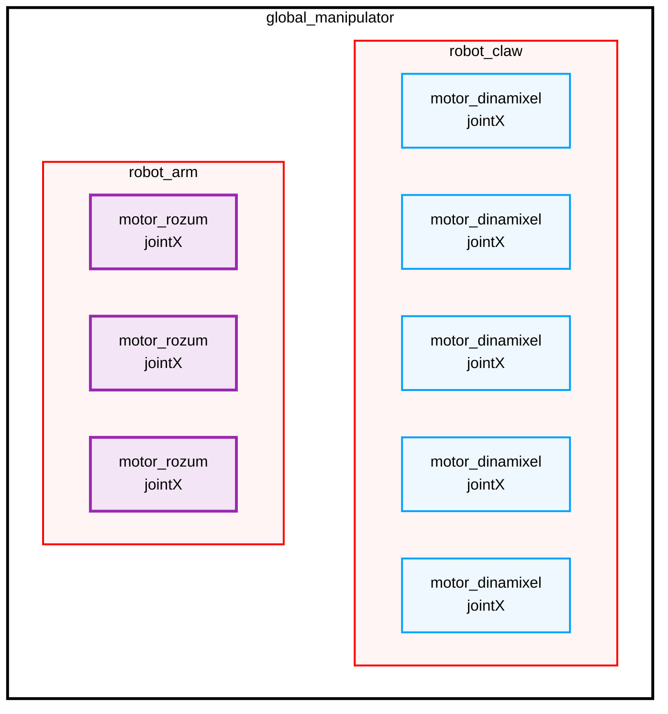
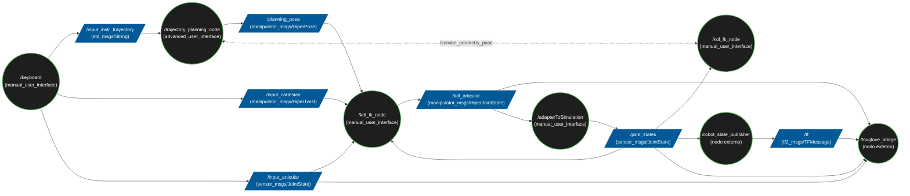

# Estructura general 

Este repositorio contiene la implementación de una arquitectura modular basada en ROS 2 para el control, 
planificación de trayectorias y visualización de un brazo manipulador. El sistema abarca desde la captura de 
comandos de bajo nivel hasta la simulación y monitorización remota.

Se ha diseñado el sistema con un formato modular para que, a partir de una base sólida, ir añadiendo nuevas implementaciones 
y características al robot de la forma más simple y directa. Para ello, se han ido creando diferentes paquetes 
y en cada paquete se implementa una capa de complejidad del manipulador.

Práticamente todos los nodos tienen un archivo cpp donde se implementan las funciones y un archivo hpp que sirve para ver las funciones y variables 
globales de dicho nodo. 

A continuación se muestra una visión general de cada paquete. Si se desea una visión más detallada ir al README de cada paquete. 
## advanced_user_interface
La idea de este paquete es que contengan todos los nodos que ayudan al manipulador a hacer una trayectoria determinada. Para eso se crean dos archivos diferentes:

- Librería Matemática (trajectory_math): Compilada como una librería compartida, encapsula toda la lógica algorítmica, interpolación de puntos y resolución 
de matrices. Al estar desacoplada del nodo, permite que, si se desea, otras partes del sistema puedan enlazar y utilizar estas matemáticas de 
forma directa con latencia mínima.

- Nodo de Planificación (trajectoryPlanning): Es el ejecutable nativo de ROS 2. Se encargar de diseñar las trayectorias en base a todas las instrucciones dadas por el usuario. 

## bringup
El paquete bringup actúa como el punto de entrada principal y "director de orquesta" de todo el sistema del brazo manipulador. Su propósito central no es inicializar todos los nodos distribuidos 
(planificadores, solvers cinemáticos, puentes de telemetría) y proporcionar al sistema la descripción física del hardware.

- launch/: Contiene el archivo simulation_script.launch.py. Este script levanta el árbol completo de nodos de ROS 2, cargando los parámetros del URDF y estableciendo las 
comunicaciones base para que el usuario pueda interactuar con el robot inmediatamente.

- description/: Centraliza el modelo cinemático (URDF/Xacro). Utiliza manipulador_modu.urdf.xacro como archivo maestro de ensamblaje. El archivo poses.yaml es el archivo
donde se puede observar dinámicamente los puntos de la trayectoria que el manipulador va a seguir. La idea a futuro es tener un modelo simulado más realista, para eso es necesario
importar una serie de archivos .gbl y .stl que definen al manipulador con más exactitud. Esos archivo son luego llamados por macros.xacros que es una plantilla para cada link. 

- meshes/: Gestiona toda la geometría del brazo con una modularidad excelente. Geometría Visual y de Colisión: Separa los modelos detallados (.stl en visual/) para la renderización, de 
los modelos simplificados (.glb en collition/) (parte no implementada). Eslabones Modulares: La carpeta links/ contiene un .xacro independiente para cada grado de libertad (de link1 a link9), 
lo que facilita enormemente ajustar las inercias o límites mecánicos de un motor específico sin romper el resto del modelo.

## api_robot
El paquete api_robot actúa como la Capa de Abstracción de Hardware (HAL) del sistema. Su propósito central es aislar la complejidad de los protocolos de comunicación físicos (como RS-485, CAN bus o TTL) 
del resto del ecosistema ROS 2.

Se ha creado un sistema modular permitiendo así que, en un futuro, si se desea cambiar un elemento del manipulador, sea fácilmente intercambiable a nivel de software. 

El sistema desarrollado va creando una serie de clases que engloba a otras clases más elementales. En consecuencia se cuenta con el siguiente esquema modularizado.  



Las clases creadas son las siguiente:
- motor_rozum : clase que cuenta con todas las funciones necesarias para configurar y enviar datos al motor rozum
- motor_dinamixel : clase que cuenta con todas las funciones necesarias para configurar y enviar datos al motor dinamixel
- robot_arm : clase que implementa los elementos del manipulador encargados de mover el brazo del manipulador (motores_rozum)
- robot_claw : clase que implementa los elementos del manipulador encargados de mover la muñeca del manipulador (motores_dinamixel)
- global_manipulator : clase que reúne todas las partes del manipulador en una sola clase 


## manipulator_msgs 
Este paquete actúa como la biblioteca de tipos de datos personalizados del sistema. La responsabilidad de manipulator_msgs es definir las estructuras de 
datos (Mensajes y Servicios) que permiten la comunicación entre el hardware del brazo robótico y la red de ROS 2.

Tipos de datos implementados:
- Mensajes de Hardware (.msg): Define estructuras como DinamixelMotorData y RozumMotorData. Esto sugiere una arquitectura muy robusta donde se extrae 
telemetría específica (temperatura, voltaje, errores de hardware) de los drivers de los servomotores Dynamixel o Rozum, yendo más allá del estándar genérico de ROS.

- Mensajes Cinemáticos Custom: Estructuras como HiperTwist, HiperPose e HiperJointState, diseñadas para transmitir los estados articulares espaciales y 
velocidades con requerimientos específicos de tu manipulador.

- Servicios (.srv): Incluye GetCurrentPose.srv, que permite a nodos como /trajectory_planning_node realizar peticiones síncronas al solucionador cinemático 
(/kdl_fk_node) para validar posiciones exactas antes de enviar comandos de movimiento al hardware real.

## manual_user_interface
Este paquete de ROS 2 es el núcleo operativo para la interacción humana y la resolución matemática del movimiento del brazo manipulador. Actúa como el estrato intermedio entre 
las órdenes del usuario (entradas físicas) y la representación espacial del robot, utilizando librerías avanzadas para calcular posiciones exactas antes de enviarlas a la simulación 
o a los controladores de hardware.

- keyboard: Es el nodo de entrada principal. Utiliza la librería SDL2 y SDL2_ttf (para la renderización de fuentes) para 
crear una interfaz de captura de eventos del teclado. Lee las pulsaciones y las traduce en comandos de movimiento para el brazo.

- adapterToSimulation: Actúa como un puente de compatibilidad. Toma los comandos articulares y los adapta al simulador para que lo pueda mostrar. Según si está en modo simulación
o en modo real se comporta de una forma u otra. 

- kdlCartesianToJoint: Es el Solver de Cinemática Inversa (IK). Utiliza la librería KDL (Kinematics and Dynamics Library) y Eigen3 para calcular qué ángulos 
exactos debe tener cada motor (espacio articular) para alcanzar una coordenada XYZ específica (espacio cartesiano).

- kdlJointToCartesian: Es el Solver de Cinemática Directa (FK). Servicio que responde a peticiones. Realiza el proceso inverso: lee los ángulos actuales de los motores y calcula la posición exacta 
del efector final (la punta del brazo) en el espacio tridimensional. 


## Ejecución del Código
Para ejecutar el código es necesario lanzar el comando ```bash ros2 launch bringup simulation_script.launch.py ``` desde la carpeta workspace. Además se tienen 3 argumentos para controlar 
el modo de ejecución del robot.

- sim_mode = Activa el modo simulación (true) o hardware real (false). Está por defecto en modo simulador 
- sampling_rate = Tasa de muestreo en ms para los temporizadores. Por defecto se pone en 20ms (50Hz)
- input_type = Elige el controlador(ej: "keyboard" o "joystick"). Está por defecto lanzar el teclado 

Se pueden lanzar uno, dos o todos los argumentos al mismo tiempo. Un ejemplo de lanzamiento personalizado es:

```bash
ros2 launch bringup simulation_script.launch.py sim_mode:=false sampling_rate:=10 input_type:=joystick
```

Se pueden quitar y poner características para lanzar la configuración deseada y que no sea por defecto.

Al usar la configuración por defecto se lanza el siguiente esquema de nodos (nodo de teclado, modo simulación y a 20ms):



El diagrama contiene el nodo usado junto con el paquete en el cual está contenido y el nombre del topic o servicio que lo conecta junto con el tipo de dato que se traspasa. 
