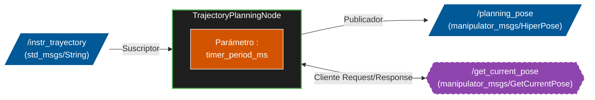

# INTERFAZ DE TRAYECTORIAS

## TrajectoryPlanningNode.hpp / .cpp

### Introducción
El nodo TrajectoryPlanningNode actúa como el núcleo computacional para la planificación y generación de trayectorias en 
el espacio cartesiano dentro del sistema robótico. Su propósito fundamental es orquestar la transición del efector final entre distintas 
configuraciones u objetivos, asegurando perfiles de movimiento suaves y matemáticamente continuos a través del uso de matrices homogéneas 
y cuaterniones. Este nodo abstrae la complejidad cinemática para los controladores de bajo nivel, enviando referencias de pose continuas y precisas.

Dentro de la arquitectura de la aplicación, este nodo opera en una modalidad híbrida: es tanto un servidor de cálculo reactivo como un generador 
proactivo. Reacciona a eventos externos mediante la escucha de instrucciones asíncronas (usualmente emitidas a través de un teclado o una interfaz 
de usuario superior) e interactúa mediante un cliente de servicios para conocer el estado actual del robot. Cuando una trayectoria es activada, el nodo 
transita a su modalidad de ejecución, donde un temporizador determinista se encarga de publicar iterativamente el flujo discreto de las poses calculadas.

El nodo destaca por su robustez en el manejo de datos algebraicos, apoyándose fuertemente en las librerías Eigen y TF2 para conversiones complejas e 
interpolaciones (tales como Slerp para cuaterniones y splines temporales). Además, incorpora características de persistencia y parametrización externa, 
permitiendo la lectura y escritura dinámica de waypoints a través de archivos de configuración YAML.

### Diagrama de Flujo

### Arquitectura y funciones principales

1. Inicialización y Destrucción
- TrajectoryPlanningNode():
Constructor principal de la clase. Inicializa el ciclo de vida del nodo de ROS 2, declara y carga las rutas 
de los archivos de parámetros (YAML), y levanta las infraestructuras de comunicación (publicadores, suscriptores, clientes y temporizadores).

Entradas: void
Salidas: void
Parámetros implícitos usados: Instancias de sub_instr_trayectory, client_pose, pub_planning_pose_, timer_play_, y rutas de directorios (poses_yaml_path).

- ~TrajectoryPlanningNode()
Destructor de la clase. Encargado de limpiar la memoria, liberar recursos dinámicos asociados a las 
conexiones de red en ROS 2 y destruir punteros seguros de forma apropiada.

Entradas: void
Salidas: void
Parámetros implícitos usados: Ninguno.

2. Interrupciones
- keyboardCallback:
Callback ejecutado asíncronamente cuando se publica un mensaje en el tópico de comandos. Evalúa 
la cadena de texto recibida para conmutar estados internos, gestionar la lectura y edición del archivo YAML y genera la trayectoria para que el manipulador
se mueva entre los puntos del archivo YAML.

Entradas: const std_msgs::msg::String::SharedPtr msg
Salidas: void
Parámetros implícitos usados: key, poses_yaml_path, variables lógicas de control para inicializar timer_play_.

- timer_play_callback: 
Bucle de control síncrono del nodo. Se encarga de evaluar en cada "tic" el progreso temporal (t_current_), realizar 
llamadas a los métodos auxiliares algebraicos para obtener la pose interpolada correspondiente a ese instante y publicarla hacia el 
controlador de bajo nivel.

Entradas: void
Salidas: void
Parámetros implícitos usados: t_max_, t_current_, sample_time_, tau_, trajectory_poses, y pub_planning_pose_.

### Variables globales
1. Publicadores, Suscriptores:
- pub_planning_pose_(manipulator_msgs::msg::HiperPose): Publicador de comandos de cada punto de la trayectoria hacia el brazo manipulador. 
- sub_instr_trayectory (std_msgs::msg::String): Suscriptor a las instrucciones del teclado del usuario
- client_pose (manipulator_msgs::srv::GetCurrentPose): Cliente de servicio para solicitar cuando lo pida el usuario el estado o pose instantánea 
actual del robot. 
- timer_play_(rclcpp::TimerBase::SharedPtr): encargado del ciclo síncrono de cálculo y envío de cada punto de la trayectoria.

2. Uso archivo YAML
- poses_root (YAML::Node): utilizado para cargar en memoria, buscar, parsear y editar la jerarquía de configuraciones proveniente del archivo
YAML poses_yaml 
- poses_yaml_path (std::string): Almacena la ruta absoluta en el sistema de archivos del paquete donde se lee/escribe el archivo .yaml.
- key (std::string): guarda el nombre de la pose usada en el archivo YAML (e.g. "pick", "place").
- num_pose (uint8_t): dice el número de poses que hay en el archivo YAML.

3. Variables de Control:
- t_max_ (double): Determina la duración total (en segundos) exigida para la completitud de la trayectoria global. (Valor por defecto: 10.0).
- t_current_ (double): Rastrea el tiempo transcurrido (estado del progreso temporal) dentro de la trayectoria actual. (Valor de inicio: -t_max_).
- sample_time_(double): Representa el paso de discretización ($dt$ o tiempo de muestreo) mediante el cual avanzan las iteraciones de control.
- tau_(int): Parámetro temporal que define el umbral a partir del cual el cálculo comienza la transición de un punto de vía (waypoint) al siguiente. 
(Valor por defecto: 1).

4. Estructuras de Datos:
- trajectory_poses (std::vector<Eigen::Matrix4d>): array secuencial que preserva en memoria la lista de matrices de transformación 4x4, 
las cuales actúan como los vértices o puntos clave (waypoints) por los cuales el efector final debe pasar.

## trajectory_math.hpp / .cpp
### Introducción
La librería trajectory_math actúa como el motor algebraico y de transformaciones espaciales para el 
sistema de planificación del robot. Su propósito general es proporcionar una abstracción matemática robusta para 
operar con posiciones y orientaciones en el espacio tridimensional (SE(3)), sirviendo de puente entre los tipos de datos 
nativos de ROS 2 (geometry_msgs/Pose), las estructuras de álgebra lineal de alto rendimiento (Eigen) y las herramientas de transformación (tf2).

Dentro del ecosistema robótico, esta librería no tiene un estado propio ni un ciclo de ejecución continuo; opera bajo demanda 
como un conjunto de utilidades estáticas invocadas por el nodo de planificación. Es responsable de tareas críticas como la persistencia 
de configuraciones espaciales (lectura y escritura de matrices en formato YAML) y la generación de perfiles de movimiento espacial, evitando 
problemas típicos de la robótica como el gimbal lock mediante el uso exhaustivo de cuaterniones.

Sus características principales incluyen la capacidad de interpolación esférica (SLERP) para orientaciones, la conversión segura entre matrices 
de rotación y cuaterniones contemplando casos de singularidad matemática, y la interpolación polinómica entre tres poses consecutivas. Esto último 
permite crear zonas de transición suaves (blending) en trayectorias cartesianas complejas, garantizando continuidad tanto en posición como en 
velocidad para los controladores de las articulaciones.

### Diagrama de Flujo
No está conectado con otros nodos por lo que no tiene diagrama de flujo

### Arquitectura y funciones principales

1. Edición archivo YAML
- ParsePoseMatrix
Abre un archivo YAML específico, busca una secuencia matricial mediante una clave string y la convierte iterativamente en una 
matriz homogénea de Eigen. Incorpora validación de formato (4x4) para evitar fallos de memoria.

Entradas: const std::string &key: nombre pose en el archivo YAML, const std::string &poses_yaml_path: ruta archivo YAML
Salidas: Eigen::Matrix4d: matriz de la pose recogida del archivo YAML
Parámetros implícitos usados: Instancias de lectura de la librería YAML::Node y acceso directo al sistema de archivos local.

- AddPoseMatrix
Sobreescribe o añade una nueva matriz de transformación 4x4 en un archivo YAML bajo una clave específica. Construye 
la jerarquía de nodos YAML fila por fila a partir de una matriz Eigen y guarda los cambios en disco.

Entradas: const std::string &key, const Eigen::Matrix4d &pose, const std::string &poses_yaml_path
Salidas: void
Parámetros implícitos usados: Instancias de YAML::Node, flujos de salida std::ofstream y acceso al sistema de archivos.

2. Operaciones con quaternios
- MuliplyQuaternions
Implementa algebraicamente el producto de Hamilton para dos cuaterniones, resolviendo la rotación combinada de dos orientaciones espaciales en el formato de tf2.

Entradas: const tf2::Quaternion &q1, const tf2::Quaternion &q2
Salidas: tf2::Quaternion
Parámetros implícitos usados: Ninguno.

- InverseQuaternion
Calcula el cuaternión inverso, que representa la rotación opuesta. Incluye una validación de seguridad geométrica para evitar divisiones por 
cero evaluando la norma cuadrada del cuaternión.

Entradas: const tf2::Quaternion &q
Salidas: tf2::Quaternion
Parámetros implícitos usados: Tolerancia de norma estática implícita (1e-12).

- rot2Quat
Convierte una matriz de rotación de Eigen (3x3) en un cuaternión de tf2. Su algoritmo interno previene singularidades matemáticas evaluando la traza de la matriz y calculando los componentes con precauciones frente a valores cercanos a cero.

Entradas: const Eigen::Matrix3d &R, int m
Salidas: tf2::Quaternion
Parámetros implícitos usados: Tolerancia estática para el cálculo del componente escalar W (1e-3).

- PoseToMatrix
Extrae la información traslacional y rotacional (cuaternión) de un mensaje estándar de ROS 2 y compone una matriz homogénea 4x4 matemáticamente manejable.

Entradas: const geometry_msgs::msg::Pose& pose
Salidas: Eigen::Matrix4d
Parámetros implícitos usados: Dependencia funcional de tf2::Matrix3x3 para la conversión interna de cuaternión a matriz de rotación.

3. Generación de trayectorias
- PoseInterpolation
Realiza una interpolación lineal espacial (LERP) para el vector de posición y una interpolación esférica matemática para las 
orientaciones dadas dos matrices y un parámetro escalar de progresión (lambda). (para poder entenderlo es necesario tener conocimiento de 
ciertos conceptos teóricos)

Entradas: const Eigen::Matrix4d &start_pose, const Eigen::Matrix4d &end_pose, double lambda
Salidas: std::pair<tf2::Vector3, tf2::Quaternion>
Parámetros implícitos usados: Dependencia de las funciones locales rot2Quat, InverseQuaternion y MuliplyQuaternions.

- ComputeNextCartesianPose
Función algorítmica compleja que calcula la pose transicional iterativa basándose en tres matrices de paso y una ventana temporal parabólica. 
Diferencia entre tres zonas de la trayectoria (aproximación, zona de mezcla/blending y salida) en función del parámetro temporal t. 
(para poder entenderlo es necesario tener conocimiento de ciertos conceptos teóricos)

Entradas: const Eigen::Matrix4d &pose_0, const Eigen::Matrix4d &pose_1, const Eigen::Matrix4d &pose_2, double tau, double T, double t
Salidas: std::pair<tf2::Vector3, tf2::Quaternion>
Parámetros implícitos usados: Umbrales estáticos de tolerancia para la prevención de divisiones por cero al normalizar vectores (1e-6).

### Variables globales
Al ser una librería de funciones no contiene librerías globales.
