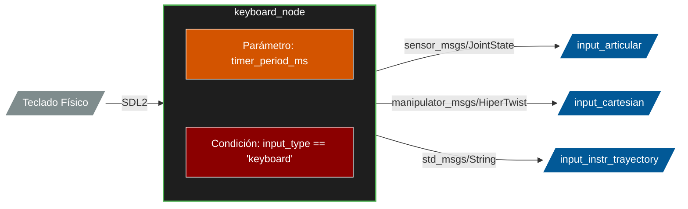
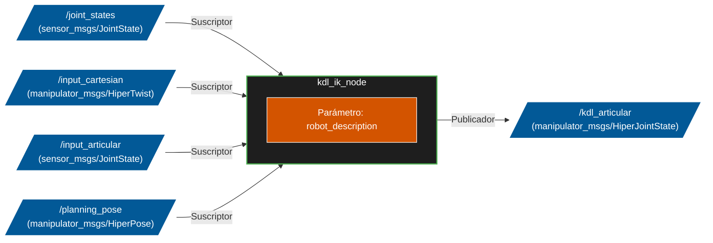
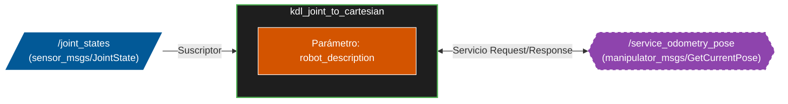
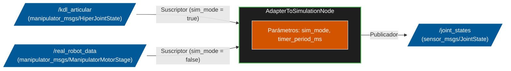

# CONTROL MANUAL DEL ROBOT
A continuación se explican cómo trabajan los siguientes archivos. 

## keyboard.hpp/keyboard.cpp

### Introducción

Este paquete proporciona un nodo de ROS 2 (keyboard_node) diseñado para la teleoperación en tiempo real de un brazo robótico manipulador. Este nodo implementa una Interfaz Gráfica de Usuario (GUI) utilizando la librería SDL2.

El nodo actúa como el "cerebro de control manual" del sistema, traduciendo las pulsaciones del usuario en comandos de movimiento precisos. Cuenta con una máquina de estados que permite controlar el robot en tres modalidades diferentes:

1. Espacio Articular: Control directo del teclado y velocidad independiente para cada uno de los 8 motores del brazo.

2. Espacio Cartesiano: Movimiento del efector final (TCP) en el espacio 3D (Traslación X, Y, Z y Rotación Roll, Pitch, Yaw), permitiendo alternar entre el marco de referencia de la base o de la herramienta.

3. Modo Trayectoria: Una interfaz para guardar puntos en el espacio y ordenar la ejecución de trayectorias planificadas.

### Diagrama de Flujo

### Arquitectura y funciones principales

1. Inicialización y Destrucción
- KeyboardNode() (Constructor): Inicializa los subsistemas de video y fuentes de la librería SDL2 y crea la ventana gráfica del "Panel de Control". Además, declara el parámetro del temporizador, configura tres publicadores de ROS 2 (para comandos articulares, cartesianos y de trayectoria) y dimensiona los vectores de los mensajes.

Entradas: void
Salidas: void
Parametros implícitos usados: timer_period_ms (control velocidad timer_. proviene del launch) 

- ~KeyboardNode() (Destructor): Garantiza un cierre limpio y seguro del nodo. Se encarga de liberar la memoria de las texturas, cerrar la ventana gráfica y apagar los subsistemas de SDL para evitar fugas de memoria (memory leaks) al detener la ejecución.

Entradas: void
Salidas: void
Parametros implícitos usados: void

2. Bucle Principal de Control
- timer_callback(): Se ejecuta de forma cíclica según el parámetro de entrada 'timer_period_ms'(por defecto cada 20ms). Su función es capturar el estado completo del hardware (teclado) mediante SDL_PumpEvents() en cada interrupción para controlar el estado del nodo y publicar la información que deseé el usuario en cada momento. Actualiza en cada ciclo el mensaje que debe aparecer por pantalla

Entradas: void
Salidas: void
Parametros implícitos usados: timer_ (interrupción llama función), SDL (registra entradas por teclado)

3. Modos de operación
- articular_mode(const Uint8 *state): Se activa cuando el robot está en Modo Manual y Espacio Articular. Mapea teclas específicas para aumentar o disminuir la velocidad de referencia y asigna comandos de movimiento directos a cada articulación de forma independiente, diferenciando entre cada tipo de motor. 

Entradas: state (const Uint8*): puntero que apunta a variable que indica estado del telado
Salidas: void
Parametros implícitos usados: void

- cartesian_mode(const Uint8 *state): Se activa en Modo Manual y Espacio Cartesiano. Traduce las pulsaciones del usuario en un mensaje tipo Twist (velocidades lineales en X, Y, Z y angulares en Roll, Pitch, Yaw). También gestiona la apertura/cierre de la garra y alterna el sistema de coordenadas de referencia (BASE o TCP).

Entradas: state (const Uint8*): puntero que apunta a variable que indica estado del telado
Salidas: void
Parametros implícitos usados: void

- trajectory_mode(const Uint8 *state): Se activa en el Modo Trayectoria. En lugar de enviar comandos de velocidad continua, envía Strings (cadenas de texto) de alto nivel ("SAVE", "HOME", "PLAY") a los nodos encargados de la planificación de movimiento, asegurándose de enviar el comando una sola vez por pulsación.

Entradas: state (const Uint8*): puntero que apunta a variable que indica estado del telado
Salidas: void
Parametros implícitos usados: void

3. Motor Gráfico (UI)

- render_text(const std::string &text, int x, int y, SDL_Color color): Función auxiliar de renderizado. Toma un texto, unas coordenadas y un color, genera una textura temporal utilizando SDL_ttf y la estampa en el buffer de la pantalla gráfica.

Entradas: text (const std::string &): referencia a cadena de texto; x (int): coordenada en el eje X de la ventana; y (int): coordenada en el eje Y de la ventana; color (SDL_Color):
Salidas: void
Parametros implícitos usados: void 

- render_ui(): Dibuja toda la interfaz de usuario en la ventana. Es altamente dinámica: evalúa las variables booleanas de la máquina de estados y pinta en pantalla únicamente los controles, teclas y parámetros (como el marco de referencia actual) que son válidos para el modo en el que se encuentra el operador en ese preciso instante.

Entradas: void
Salidas: void
Parametros implícitos usados: lee directamente los parámetros globales

4. Entrada de Ejecución

- main(int argc, char * argv[]):
La función estándar de C++ y ROS 2. Inicializa el entorno de ROS (rclcpp::init), instancia el KeyboardNode y lo mantiene vivo y escuchando eventos mediante rclcpp::spin() hasta que el usuario decide cerrar el programa.

Entradas: argc (int): indica el número de argumentos o palabras pasadas por la terminal al ejecutar el nodo; argv (char * []): Contiene los textos exactos que el usuario escribió en la terminal al lanzar el comando de ROS 2.
Salidas: return 0 (int): 
Parametros implícitos usados: lee directamente los parámetros globales 

### Variable globales

1. Publicadores y Temporizadores

- publisher_articular_ (rclcpp::Publisher<sensor_msgs::msg::JointState>::SharedPtr): Se encarga de enviar (publicar) los comandos de velocidad individuales para cada uno de los 8 motores del brazo en el tópico input_articular
- publisher_cartesian_ (rclcpp::Publisher<manipulator_msgs::msg::HiperTwist>::SharedPtr): Publica las órdenes de movimiento espacial (velocidad de traslación en XYZ, rotación y apertura de la garra) en el tópico input_cartesian
- publisher_trayectory_ (rclcpp::Publisher<std_msgs::msg::String>::SharedPtr): Publica comandos de texto sencillos (como "SAVE", "HOME" o "PLAY") en el tópico input_instr_trayectory para la gestión de las trayectorias automáticas
- timer_ (rclcpp::TimerBase::SharedPtr): Un reloj interno (temporizador) que ejecuta la función timer_callback en un bucle constante (por defecto cada 20 ms), permitiendo "escuchar" el teclado de forma continua sin bloquear el programa

2. Interfaz Gráfica (SDL)

- window_ (SDL_Window):* Puntero que se dirige hacia la ventana del panel de control que creas en pantalla. Es necesaria para que el sistema operativo sepa a dónde dirigir las pulsaciones de teclado que haces
- renderer_ (SDL_Renderer):* Se encarga de pintar el fondo y renderizar el texto en cada iteración
- font_ (TTF_Font):* Almacena en memoria la tipografía (la fuente de texto Ubuntu o DejaVu) con la que se escriben los mensajes en tu panel de control.

3. Variables de Control
- ref_vel_rozum (float): Almacena la velocidad base a la que se moverán los motores grandes Rozum . 
- ref_vel_dinamixel (float): Almacena la velocidad base para los servomotores Dinamixel .
- ref_vel_cartesian (float): Guarda la velocidad global de desplazamiento y rotación cuando el robot se mueve en el espacio cartesiano.
- flag_q, flag_a, flag_t, flag_g, flag_m, flag_b, flag_h, flag_p, flag_n (bool): Son banderas "anti-rebote" (debouncing). Evitan que al mantener pulsada una tecla (por ejemplo, la 'M' para cambiar de modo), el programa cambie de estado cientos de veces en un solo segundo; garantizan que se ejecute la acción solo una vez por cada pulsación física.
- cartesian_mode_ (bool): Define el espacio geométrico actual. Si es true, el teclado mueve el robot en ejes coordenados XYZ (cartesiano). Si es false, el teclado mueve cada motor de forma independiente (articular).
- referencia_base_ (bool): Exclusivo del modo cartesiano. Si es true, los ejes XYZ se calculan desde la base fija del robot. Si es false, los ejes se calculan desde la punta de la herramienta (TCP).
- manual_mode_ (bool): Determina el flujo principal del programa. Si es true, tienes control directo con las teclas (ya sea articular o cartesiano). Si es false, pasas al modo de gestión de puntos y ejecución de trayectorias.

4. Estructuras de Datos
- msg_articular_ (sensor_msgs::msg::JointState): lugar donde se empaquetan las velocidades calculadas para los 8 motores antes de ser enviado por publisher_articular_.
- msg_cartesian_ (manipulator_msgs::msg::HiperTwist): Estructura que almacena los comandos de traslación (linear), rotación (angular), estado del gripper (garra) y el marco de referencia ("BASE" o "TCP") antes de enviarlo por publisher_cartesian_.
- msg_trayectory_ (std_msgs::msg::String): Mensaje de texto simple que almacena la orden de trayectoria actual ("SAVE", "HOME", "PLAY") a punto de ser publicada. Se resetea en cada ciclo para no enviar comandos repetidos.

## joystick.hpp/joystick.cpp

Nodo por implementar, debería hacer mismas funciones que el teclado pero realizadas por el joystick

## kdlCartesianToJoint.hpp/kdlCartesianToJoint.cpp
### Introducción
Este paquete incluye el nodo kdl_ik_node. Su objetivo es calcular la Cinemática Inversa (Inverse Kinematics) del robot, traduciendo comandos de posición y velocidad cartesianas en los comandos articulares equivalentes en tiempo real.

Este nodo utiliza la librería KDL. Al igual que en la cinemática directa, lee la descripción geométrica del robot (URDF) cargada en el sistema mediante parámetros, y construye la cadena cinemática (desde base_link hasta link7).

El nodo se suscribe a múltiples topics para recibir las distintas intenciones de movimiento (poses cartesianas planificadas, velocidades cartesianas manuales o comandos articulares directos), calcula matemáticamente las posiciones o velocidades de cada motor usando solvers iterativos (Newton-Raphson y Damped Least Squares) y publica instantáneamente el resultado para que el robot se mueva. Este nodo permite unificar toda la información que llega de todos los diferentes topics en un solo topic. 

### Diagrama de flujo

### Arquitectura y funciones principales

1. Inicialización y Destrucción

- KdlCartesianToJoint(): Define los límites de velocidad, llama a initKDL() para inicializar la matemática de la cadena y los solvers, y levanta todos los suscriptores necesarios (/joint_states, /input_cartesian, /input_articular, /planning_pose) así como el publicador final (/kdl_articular).

Entradas: void
Salidas: void
Parámetros implícitos usados: void

- ~KdlCartesianToJoint(): Destructor estándar que imprime un mensaje indicando la finalización del nodo en los logs de ROS.

Entradas: void
Salidas: void
Parámetros implícitos usados: void

- initKDL(): Busca y extrae la descripción geométrica (robot_description), genera un árbol URDF y extrae la cadena cinemática (base_link a link7). Configura los solvers de KDL: FK para cinemática directa, IK Vel (con algoritmo Damped Least Squares) y el IK Pos (Newton-Raphson).

Entradas: void
Salidas: bool (true/false): indica si cadena es correcta o no 
Parámetros implícitos usados: robot_description (rclcpp::ParameterType::PARAMETER_STRING): describe la cadena del manipulador

2. Interrupciones 

- poseCallback(msg): Recibe una pose (posición y orientación en cuaterniones) deseada. Utiliza el solver de cinemática inversa de **posición** para calcular las posiciones de las articulaciones requeridas para alcanzarla y publica el resultado.

Entradas: msg (manipulator_msgs::msg::HiperPose::SharedPtr): puntero al mensaje que recibe el subscriptor
Salidas: void
Parámetros implícitos usados: void

- twistCallback(msg): Recibe comandos de velocidad lineal y angular (Twist). Adapta el sistema de referencia si el comando se aplica en el TCP (usando FK). Luego calcula las **velocidades** articulares con el solver IK de velocidades, aplica saturación para seguridad de los motores, añade el control de la garra y lo publica.

Entradas: msg (manipulator_msgs::msg::HiperTwist::SharedPtr) : puntero al mensaje que recibe el subscriptor
Salidas: void
Parámetros implícitos usados: void

- robotJointStateCallback(msg): Escucha en tiempo real la posición actual de los motores y actualiza el vector interno q_current_, asegurándose de emparejar correctamente los nombres de las articulaciones.

Entradas: msg (sensor_msgs::msg::JointState::SharedPtr) : puntero al mensaje que recibe el subscriptor
Salidas: void
Parámetros implícitos usados: void.

jStateCallback(msg): Permite un puente directo (passthrough). Si se reciben comandos articulares manuales, simplemente los redimensiona, añade el flag "MANUAL" y los reenvía por el publicador final.

Entradas: msg(sensor_msgs::msg::JointState::SharedPtr): puntero al mensaje que recibe el subscriptor
Salidas: void
Parámetros implícitos usados: void

3. Entrada de Ejecución

- main(int argc, char * argv[]):
La función estándar de C++ y ROS 2. Inicializa el entorno de ROS (rclcpp::init), instancia el KeyboardNode y lo mantiene vivo y escuchando eventos mediante rclcpp::spin() hasta que el usuario decide cerrar el programa.

### Variable globales

1. Variables de configuración

- joint_velocity_limit_: (double) establece el límite máximo de velocidad articular permitido por seguridad. Se utiliza en el twistCallback como umbral de saturación (std::clamp) para evitar que el algoritmo matemático envíe velocidades peligrosamente altas a los motores del robot cuando se resuelven comandos de velocidad.

- joint_names_: (std::vector<std::string>) almacena los nombres de las articulaciones móviles extraídas de la descripción del robot (URDF). Es fundamental para mapear correctamente los valores que llegan del tópico /joint_states hacia el vector interno del programa, asegurando que cada ángulo vaya al motor correcto sin importar en qué orden lleguen en el mensaje de ROS.

2. Elementos KDL (Kinematics and Dynamics Library)
chain_: (KDL::Chain) Representa la cadena cinemática del robot, es decir, el modelo matemático que define las longitudes y ejes de giro desde la base (base_link) hasta la herramienta final (link7). Todos los cálculos posteriores se basan en esta cadena.

- q_current_: (Tipo KDL::JntArray) Es un vector (array) de KDL que guarda en tiempo real la posición angular actual de cada articulación. Se actualiza constantemente mediante el suscriptor de joint_states.

- ik_vel_solver_: (Tipo std::shared_ptr<KDL::ChainIkSolverVel_wdls>) Es el Solver de Cinemática Inversa de Velocidad. Utiliza el método de Mínimos Cuadrados Amortiguados Ponderados (WDLS) para traducir velocidades cartesianas (traslación y rotación en X, Y, Z) en velocidades para cada motor. Este algoritmo es clave porque evita comportamientos bruscos cuando el robot se acerca a "singularidades" (posiciones conflictivas).

- fk_solver_: (Tipo std::shared_ptr<KDL::ChainFkSolverPos_recursive>) Es el Solver de Cinemática Directa de Posición. Calcula dónde está físicamente el extremo del robot (TCP) basándose en los ángulos actuales (q_current_). En este nodo en concreto, se usa para cambiar el sistema de referencia temporalmente y calcular movimientos relativos a la propia herramienta.

- ik_pos_solver_: (Tipo std::shared_ptr<KDL::ChainIkSolverPos_NR>) Es el Solver de Cinemática Inversa de Posición. Utiliza un método iterativo (Newton-Raphson) para adivinar qué ángulos necesita cada motor para alcanzar una pose cartesiana (X, Y, Z + Orientación) objetivo. Requiere usar internamente los dos solvers anteriores para funcionar.

- joint_planning_positions_: (Tipo KDL::JntArray) Almacena los ángulos de inicio (o "semilla") que se le pasan al solver iterativo de posición. Es la posición actual del robot (q_current_) o el último punto calculado de una trayectoria.

- next_joint_planning_positions_: (Tipo KDL::JntArray) Almacena el resultado calculado por el ik_pos_solver_. Es decir, guarda la posición articular final a la que los motores deben moverse y es la variable que se empaqueta para ser publicada al robot.

3. Suscriptores y Publicadores (Interfaces de ROS 2)
- sub_js_robot: Suscriptor al tópico /joint_states. Escucha constantemente los encoders físicos del robot para saber la posición angular real de los motores en todo momento.

- sub_twist_input_: Suscriptor al tópico /input_cartesian. Recibe comandos de velocidad lineal y angular (Twists), generalmente provenientes de un joystick, un mando o un algoritmo de teleoperación.

- sub_js_input_: Suscriptor al tópico /input_articular. Recibe comandos directos para las articulaciones. Funciona como un puente que toma las posiciones de entrada y las pasa directamente a la salida (modo manual articular).

- sub_planing_pose_input_: Suscriptor al tópico /planning_pose. Recibe un objetivo de Pose Cartesiana absoluta (punto en el espacio + rotación) que el robot debe alcanzar. Enviado por planificadores de alto nivel.

- pub_cmd_: Publicador en el tópico /kdl_articular. Es la salida del nodo. Después de realizar todos los cálculos matemáticos correspondientes, este publicador envía el mensaje final estandarizado con la orden (ya sea de posición o velocidad articular) para que los controladores del robot ejecuten el movimiento

## kdlJointToCartesian.hpp/kdlJointToCartesian.cpp
Este paquete incluye el nodo kdl_joint_to_cartesian. Su objetivo es calcular la Cinemática Directa (Forward Kinematics) del robot en tiempo real al recibir una petición.

Este nodo utiliza la librería KDL. El nodo lee la descripción geométrica del robot (URDF) cargada en el sistema, construye una cadena cinemática (desde la base hasta la herramienta) y se mantiene escuchando la posición angular actual de cada motor.

Cuando otro nodo del ecosistema necesita saber la posición cartesiana exacta de la garra, hace una petición a través de un Servicio de ROS 2. El nodo calcula la pose en ese preciso instante y la devuelve instantáneamente.

### Diagrama de Flujo

### Arquitectura y funciones principales

1. Inicialización y Destrucción
- KdlJointToCartesian(): llama a initKdl() para configurar la matemática, y levanta el suscriptor de las articulaciones y el servidor del servicio de odometría 

Entradas: void
Salidas: void
Párametros implícitos usados: void

- ~KdlJointToCartesian(): Destructor estándar que imprime un mensaje de apagado seguro en los logs de ROS.

Entradas: void
Salidas: void
Parametros implícitos usados: void

- initKdl(): Extrae el modelo URDF de los parámetros de ROS. Utiliza el kdl_parser para transformar ese XML en un árbol matemático (KDL::Tree). Luego extrae específicamente la cadena que va desde el origen (base_link) hasta la muñeca/herramienta (link7). Además, reserva memoria para el array de posiciones (q_current_) e inicializa el Solver iterativo de Cinemática Directa (ChainFkSolverPos_recursive). Finalmente, obtiene el nombre de todas las articulaciones.

Entradas: void
Salidas: return true/false (bool): devuelve si se ha realizado con exito o no
Parametros implícitos usados: robot_description (rclcpp::ParameterType::PARAMETER_STRING): describe la cadena del manipulador

2. Interrupciones
- jointStateCallback(const sensor_msgs::msg::JointState::SharedPtr msg): Se ejecuta automáticamente cada vez que los motores publican su posición. Filtra el mensaje entrante, busca específicamente las articulaciones declaradas en joint_names_ e inyecta esos valores en radianes dentro de la matriz interna de KDL (q_current_).

Entradas: msg (const sensor_msgs::msg::JointState::SharedPtr (puntero inteligente)): arrays con los nombres y posiciones actuales de los motores reportados
Salidas: return true/false (bool): devuelve si se ha realizado con exito o no
Parametros implícitos usados: void 

- handleCurrentPose(...): servicio que toma la matriz de posiciones articulares actual (q_current_) y la pasa por el solver matemático fk_solver_->JntToCart(). El solver calcula un "Frame" (Matriz de transformación homogénea) que contiene el vector de traslación (X,Y,Z) y la matriz de rotación del efector final. Finalmente, extrae estos datos, convierte la rotación a Cuaterniones por estándar de ROS y envía la respuesta al nodo cliente.

Entradas: request_header (rmw_request_id_t): Metadatos de la red de ROS sobre quién hizo la petición; request (Puntero a manipulator_msgs::srv::GetCurrentPose::Request): Los datos que envía el cliente (vacío en este caso).; response (Puntero a manipulator_msgs::srv::GetCurrentPose::Response): Objeto de respuesta que debemos rellenar.
Salidas: void
Parametros implícitos usados: void 

3. Entrada en ejecución:
- int main(int argc, char **argv): inicializa el ecosistema ROS 2, crea el nodo KdlJointToCartesian y lo deja ejecutándose en bucle (spin) hasta que se interrumpe el programa

Entradas: argc (int): indica el número de argumentos o palabras pasadas por la terminal al ejecutar el nodo; argv (char * []): Contiene los textos exactos que el usuario escribió en la terminal al lanzar el comando de ROS 2.
Salidas: return 0 (int): 
Parametros implícitos usados: lee directamente los parámetros globales

### Variable globales
1. Variables calcular cadena 
- joint_names_ (std::vector<std::string>): Almacena los nombres exactos de los motores de tu brazo tal y como están definidos en el URDF

- chain_ (KDL::Chain): Representa el "esqueleto físico" de tu robot dentro de la memoria matemática. Guarda todas las distancias entre los motores (eslabones o links) y los ejes de rotación de cada articulación, empezando desde la base del robot hasta la punta de la herramienta (TCP)

- q_current_ (KDL::JntArray): Almacena los ángulos en radianes en los que se encuentra cada motor en este preciso instante. Se actualiza a la velocidad del rayo cada vez que los drivers del hardware publican datos. La letra 'q' se usa tradicionalmente en robótica clásica para representar las coordenadas articulares.

- fk_solver_ (std::shared_ptr<KDL::ChainFkSolverPos_recursive>): Toma el esqueleto físico del robot (chain_) y los ángulos actuales de los motores (q_current_), aplica toda la trigonometría compleja (matrices de transformación homogénea) eslabón por eslabón, y descubre exactamente en qué coordenadas cartesianas (X, Y, Z) está la punta del brazo.

2. Subscriptor y servicio
- joint_states_sub_ (rclcpp::Subscription<sensor_msgs::msg::JointState>::SharedPtr): Es el canal que conecta tu software matemático con los drivers físicos de los motores. Se encarga de escuchar de fondo (en el tópico /joint_states) lo que gritan los encoders de tus motores (Rozum y Dynamixel). Cada vez que detecta información nueva, dispara el callback que actualiza q_current_

- current_pose_service_ (rclcpp::Service<manipulator_msgs::srv::GetCurrentPose>::SharedPtr): Es la ventanilla de atención al cliente de este nodo. Se queda inactivo esperando a que otro programa (como tu interfaz de guardado de puntos de trayectoria) "llame a la puerta" y pregunte: "Oye, ¿dónde está el brazo ahora mismo?". Al recibir la petición, este servicio toma el cálculo del fk_solver_ y responde con las coordenadas 3D exactas.

## adapterToSimulation.hpp / .cpp
### Introducción
El nodo AdapterToSimulationNode funciona como un multiplexor y una capa de abstracción fundamental para aislar el flujo de datos articulares entre el hardware físico y el entorno de simulación/visualización. Su propósito principal es unificar y estandarizar la forma en la que el estado cinemático del robot (posiciones y velocidades de las articulaciones) se reporta al sistema global de ROS 2, publicando siempre mensajes estándar sensor_msgs/JointState que alimentan al árbol de transformaciones (TF) y a herramientas como RViz.

El papel que juega dentro del sistema se divide en dos modalidades de operación mutuamente excluyentes, dictadas en tiempo de lanzamiento mediante el parámetro sim_mode. Si el sistema opera con el robot real, el nodo actúa como un traductor directo, suscribiéndose a la telemetría cruda de los motores físicos (mezclando datos de motores Rozum y Dinamixel) y reempaquetándola. Por el contrario, si opera en simulación, el nodo asume el rol de un integrador cinemático que procesa comandos articulares teóricos a una frecuencia constante definida por un temporizador.

Además de su función de enrutamiento, el nodo implementa una pequeña máquina de estados (MANUAL, TRAJECTORY) que modifica su comportamiento lógico en simulación. En el modo trayectoria, actúa como un puente directo (passthrough) de las coordenadas calculadas; mientras que, en el modo manual, realiza una integración numérica discreta sobre las velocidades comandadas para estimar y generar de forma continua las posiciones articulares resultantes, previniendo además singularidades cinemáticas al inicio mediante la inyección de offsets predefinidos.

### Diagrama de Flujo

### Arquitectura y funciones principales

1. Inicicialización y destrucción
- AdapterToSimulationNode() Constructor de la clase. Inicializa los parámetros de ROS 2 desde el servidor de parámetros (o launch file), dimensiona y nombra los vectores de la estructura de estado articular. Basado en el parámetro sim_mode, decide si instanciar el suscriptor de telemetría física o, alternativamente, el suscriptor de comandos simulados junto con su respectivo bucle temporizado. Inicializa posiciones de seguridad para evitar singularidades.
(buscar alternativa para solucionar las singularidades)

Entradas: void 
Salidas: void
Parámetros implícitos usados: sim_mode, timer_period_ms, pub_joint_states_, sub_physic_robot_, sub_articular_, timer_, joint_state_msg_, posiciones_actuales_, ultimo_tiempo_.

- ~AdapterToSimulationNode(): Destructor de la clase. Imprime un log informando de la finalización controlada del nodo y libera los recursos de los shared pointers de ROS 2.

Entradas: void
Salidas: void
Parámetros implícitos usados: Instancia del logger de ROS 2.

- callback_simul: Callback activado al recibir comandos dirigidos a la simulación. Actúa como el controlador de transiciones de la máquina de estados evaluando el campo command_info ("FIRST", "LAST", "MANUAL"). Muta el estado lógico del nodo y actualiza los búferes internos de posición y velocidad, aplicando truncamientos de seguridad si los datos recibidos (tamaño del vector) son insuficientes.

Entradas: const manipulator_msgs::msg::HiperJointState::SharedPtr msg
Salidas: void
Parámetros implícitos usados: current_mode_, posiciones_actuales_, velocidades_actuales_.

- callback_real: Callback exclusivo del modo físico. Recibe los estados en bruto directamente de las controladoras de los motores (3 Rozum y 5 Dinamixel). Desempaqueta estas estructuras anidadas en hardware y unifica los 8 motores en un único mensaje estándar, publicándolo inmediatamente con su respectiva marca de tiempo (timestamp)

Entradas: const manipulator_msgs::msg::ManipulatorMotorStage::SharedPtr msg
Salidas: void
Parámetros implícitos usados: joint_state_msg_, pub_joint_states_.

- timer_callbackDescripción: Bucle síncrono exclusivo del modo simulación. Calcula el diferencial de tiempo ($dt$) real entre llamadas. Si el estado es TRAJECTORY, inyecta en el mensaje las posiciones directamente; si es MANUAL, integra las velocidades comandadas ($Pos_t = Pos_{t-1} + Vel * dt$) para deducir la posición actual. Finalmente, publica el mensaje estandarizado.

Entradas: void
Salidas: void
Parámetros implícitos usados: ultimo_tiempo_, current_mode_, posiciones_actuales_, velocidades_actuales_, joint_state_msg_, pub_joint_states_.

### Variables globales

1. Publicadores, Suscriptores y Temporizadores
- pub_joint_states_ (sensor_msgs::msg::JointState): Publicador del estado unificado y final del robot para la simulación.
- sub_articular_ (manipulator_msgs::msg::HiperJointState): Suscriptor a las peticiones de movimiento para alimentar la simulación.
- sub_physic_robot_ (manipulator_msgs::msg::ManipulatorMotorStage): Suscriptor a la telemetría real proveniente del driver de los motores físicos.
- timer_: Temporizador de ROS 2 para gobernar el bucle asíncrono de cálculo y publicación a la simulación.

2. Variables de Control:
- sim_mode (bool): Bandera arquitectónica extraída de los parámetros que bifurca todo el comportamiento del nodo (Falso = Passthrough físico, Verdadero = Simulación iterativa).
- timer_period_ms (int): Intervalo en milisegundos que define la frecuencia de actualización del timer_.
- current_mode_ (RobotMode (Enum)). Variable de la máquina de estados interna; distingue entre MANUAL (donde se requiere integración numérica) y TRAJECTORY (modo de streaming puro).

3. Estructuras de Datos:
- posiciones_actuales_ / velocidades_actuales_(std::vector<double>): Actúan como búferes de memoria RAM estáticos (pre-reservados a un tamaño de 8) para retener el estado articular más reciente sin depender de variables locales.
- joint_state_msg_ (sensor_msgs::msg::JointState): Pre-configurada en el constructor con los nombres de las 8 articulaciones y el frame base para ahorrar procesamiento durante los callbacks.
- ultimo_tiempo_ (rclcpp::Time): Almacena la marca de tiempo absoluta de la última ejecución del temporizador, indispensable para calcular derivadas e integrales de tiempo correcto.
