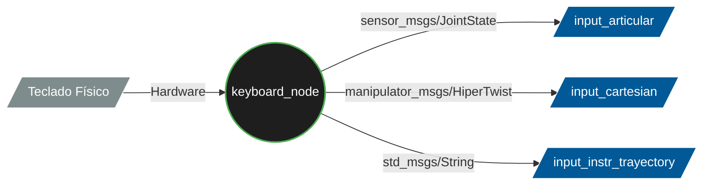
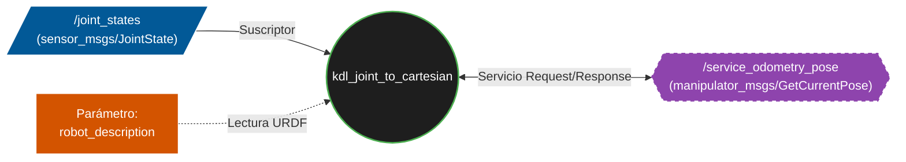

# CONTROL MANUAL DEL ROBOT

## keyboard.hpp/keyboard.cpp

### Introducción

Este paquete proporciona un nodo de ROS 2 (keyboard_node) diseñado para la teleoperación en tiempo real de un brazo robótico manipulador. Este nodo implementa una Interfaz Gráfica de Usuario (GUI) utilizando la librería SDL2.

El nodo actúa como el "cerebro de control manual" del sistema, traduciendo las pulsaciones del usuario en comandos de movimiento precisos. Cuenta con una máquina de estados que permite controlar el robot en tres modalidades diferentes:

1. Espacio Articular: Control directo del teclado y velocidad independiente para cada uno de los 8 motores del brazo.

2. Espacio Cartesiano: Movimiento del efector final (TCP) en el espacio 3D (Traslación X, Y, Z y Rotación Roll, Pitch, Yaw), permitiendo alternar entre el marco de referencia de la base o de la herramienta.

3. Modo Trayectoria: Una interfaz tipo Teach Pendant para guardar puntos en el espacio y ordenar la ejecución de trayectorias planificadas.

### Diagrama de Flujo

### Arquitectura y funciones principales

1. Inicialización y Destrucción
- KeyboardNode() (Constructor): Inicializa los subsistemas de video y fuentes de la librería SDL2 y crea la ventana gráfica del "Panel de Control". Además, declara el parámetro del temporizador, configura tres publicadores de ROS 2 (para comandos articulares, cartesianos y de trayectoria) y dimensiona los vectores de los mensajes.

Entradas: void
Salidas: void
Parametros implícitos usados: timer_period_ms (control velocidad timer_. proviene del launch) 

- ~KeyboardNode() (Destructor): Garantiza un cierre limpio y seguro del nodo. Se encarga de liberar la memoria de las texturas, cerrar la ventana gráfica y apagar los subsistemas de SDL para evitar fugas de memoria (memory leaks) al detener la ejecución.

Entradas: void
Salidas: void
Parametros implícitos usados: void

2. Bucle Principal de Control
- timer_callback(): Se ejecuta de forma cíclica según el parámetro de entrada 'timer_period_ms'(por defecto cada 20ms). Su función es capturar el estado completo del hardware (teclado) mediante SDL_PumpEvents() en cada interrupción para controlar el estado del nodo y publicar la información que deseé el usuario en cada momento. Actualiza en cada ciclo el mensaje que debe aparecer por pantalla

Entradas: void
Salidas: void
Parametros implícitos usados: timer_ (interrupción llama función), SDL (registra entradas por teclado)

3. Modos de operación
- articular_mode(const Uint8 *state): Se activa cuando el robot está en Modo Manual y Espacio Articular. Mapea teclas específicas para aumentar o disminuir la velocidad de referencia y asigna comandos de movimiento directos a cada articulación de forma independiente, diferenciando entre cada tipo de motor. 

Entradas: state (const Uint8*): puntero que apunta a variable que indica estado del telado
Salidas: void
Parametros implícitos usados: void

- cartesian_mode(const Uint8 *state): Se activa en Modo Manual y Espacio Cartesiano. Traduce las pulsaciones del usuario en un mensaje tipo Twist (velocidades lineales en X, Y, Z y angulares en Roll, Pitch, Yaw). También gestiona la apertura/cierre de la garra y alterna el sistema de coordenadas de referencia (BASE o TCP).

Entradas: state (const Uint8*): puntero que apunta a variable que indica estado del telado
Salidas: void
Parametros implícitos usados: void

- trajectory_mode(const Uint8 *state): Se activa en el Modo Trayectoria. En lugar de enviar comandos de velocidad continua, envía Strings (cadenas de texto) de alto nivel ("SAVE", "HOME", "PLAY") a los nodos encargados de la planificación de movimiento, asegurándose de enviar el comando una sola vez por pulsación.

Entradas: state (const Uint8*): puntero que apunta a variable que indica estado del telado
Salidas: void
Parametros implícitos usados: void

3. Motor Gráfico (UI)

- render_text(const std::string &text, int x, int y, SDL_Color color): Función auxiliar de renderizado. Toma un texto, unas coordenadas y un color, genera una textura temporal utilizando SDL_ttf y la estampa en el buffer de la pantalla gráfica.

Entradas: text (const std::string &): referencia a cadena de texto; x (int): coordenada en el eje X de la ventana; y (int): coordenada en el eje Y de la ventana; color (SDL_Color):
Salidas: void
Parametros implícitos usados: void 

- render_ui(): Dibuja toda la interfaz de usuario en la ventana. Es altamente dinámica: evalúa las variables booleanas de la máquina de estados y pinta en pantalla únicamente los controles, teclas y parámetros (como el marco de referencia actual) que son válidos para el modo en el que se encuentra el operador en ese preciso instante.

Entradas: void
Salidas: void
Parametros implícitos usados: lee directamente los parámetros globales

4. Entrada de Ejecución

- main(int argc, char * argv[]):
La función estándar de C++ y ROS 2. Inicializa el entorno de ROS (rclcpp::init), instancia el KeyboardNode y lo mantiene vivo y escuchando eventos mediante rclcpp::spin() hasta que el usuario decide cerrar el programa.

Entradas: argc (int): indica el número de argumentos o palabras pasadas por la terminal al ejecutar el nodo; argv (char * []): Contiene los textos exactos que el usuario escribió en la terminal al lanzar el comando de ROS 2.
Salidas: return 0 (int): 
Parametros implícitos usados: lee directamente los parámetros globales 

### Parámetros globales

## joystick.hpp/joystick.cpp

Nodo por implementar, debería hacer mismas funciones que el teclado para realizadas por el joystick

## kdlCartesianToJoint.hpp/kdlCartesianToJoint.cpp

## kdlJointToCartesian.hpp/kdlJointToCartesian.cpp
Este paquete incluye el nodo kdl_joint_to_cartesian. Su objetivo es calcular la Cinemática Directa (Forward Kinematics) del robot en tiempo real al recibir una petición.

Este nodo utiliza la librería KDL. El nodo lee la descripción geométrica del robot (URDF) cargada en el sistema, construye una cadena cinemática (desde la base hasta la herramienta) y se mantiene escuchando la posición angular actual de cada motor.

Cuando otro nodo del ecosistema necesita saber la posición cartesiana exacta de la garra, hace una petición a través de un Servicio de ROS 2. El nodo calcula la pose en ese preciso instante y la devuelve instantáneamente.

### Diagrama de Flujo

### Arquitectura y funciones principales

1. Inicialización y Destrucción
- KdlJointToCartesian(): Define los nombres de las articulaciones (joint1 a joint6), llama a initKdl() para configurar la matemática, y levanta el suscriptor de las articulaciones y el servidor del servicio de odometría 

Entradas: void
Salidas: void
Parametros implícitos usados: 

- ~KdlJointToCartesian(): Destructor estándar que imprime un mensaje de apagado seguro en los logs de ROS.

Entradas: void
Salidas: void
Parametros implícitos usados: void

- initKdl(): Extrae el modelo URDF de los parámetros de ROS. Utiliza el kdl_parser para transformar ese XML en un árbol matemático (KDL::Tree). Luego extrae específicamente la cadena que va desde el origen (base_link) hasta la muñeca/herramienta (link7). Finalmente, reserva memoria para el array de posiciones (q_current_) e inicializa el Solver iterativo de Cinemática Directa (ChainFkSolverPos_recursive).

Entradas: void
Salidas: return true/false (bool): devuelve si se ha realizado con exito o no
Parametros implícitos usados: void

2. Arquitectura y funciones principales

